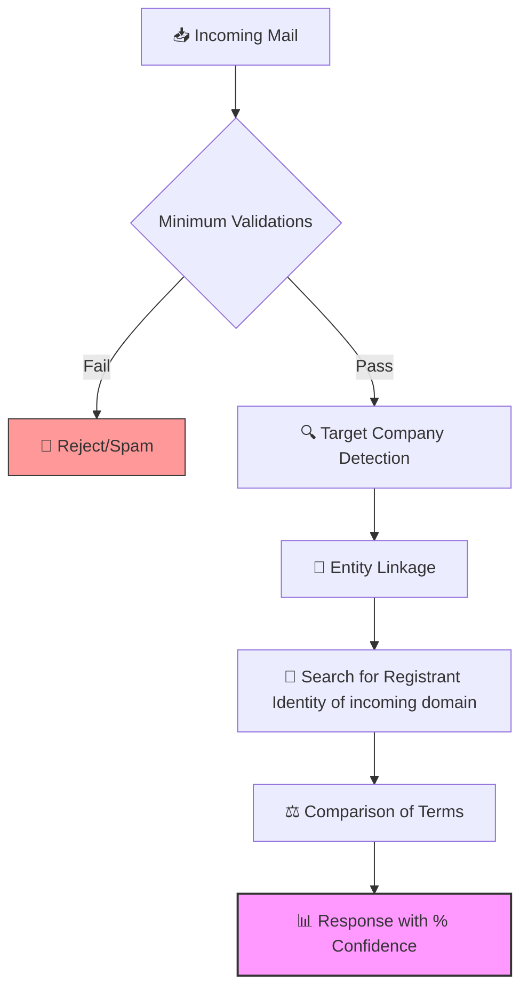

`⚠️ This application is currently under development`
`For the last updates review the FEATURE branch`

# 🏛️ Medousa: AI-Powered Email Domain Sanitization & Phishing Detection

An intelligent, production-ready system for validating, sanitizing, and detecting phishing attempts in email addresses. Medousa combines advanced domain analysis, WHOIS integration, brand recognition, and machine learning to provide accurate email security verdicts.

## 🎯 Overview

**Medousa** is a full-stack application designed to protect organizations from email-based phishing attacks and spoofing attempts. It analyzes email domains against multiple data sources including:

- Known brand registries with WHOIS data
- Personal email provider databases (Gmail, Outlook, etc.)
- Geolocation and country code TLDs
- Privacy WHOIS patterns
- Custom omit-word lists for domain parsing
- AI-powered similarity analysis using Levenshtein distance

### Core Features

✅ **Email Validation** - Comprehensive format and domain verification  
✅ **Domain Sanitization** - Extract legitimate company names from domains  
✅ **Phishing Detection** - Identify domain impersonation and spoofing  
✅ **Brand Matching** - Match domains against known brand repositories  
✅ **Confidence Scoring** - Get probability scores for each verdict  
✅ **Detailed Evidence** - Understand why an email was flagged  
✅ **Multi-TLD Support** - Handle ASCII, IDN, and geo-based TLDs  

## 🪀 Flow


## 🏗️ Architecture

Medousa is a **full-stack microservices application** with two main components:

### Backend (Python + FastAPI)

A robust REST API built with FastAPI that handles all domain analysis logic:

```text
backend/
├── app.py                    # FastAPI application entry point
├── opensearch_client.py      # OpenSearch connection management
├── requirements.txt          # Python dependencies
├── service/                  # Core business logic
    ├── service.py            # Main DomainSanitizerService
    ├── sanitize_email.py     # Email validation & phishing detection
    ├── known_brands_v3_service.py # Brand database & matching
    ├── mail_names_service.py      # Personal email providers
    ├── omit_words_service.py      # Domain parsing hints
    ├── privacy_values_service.py  # WHOIS privacy detection
    ├── ascii_cctld_service.py     # Country code TLD management
    ├── ascii_geotld_service.py    # Geographic TLD handling
    └── idn_cctld_service.py       # Internationalized domain names
└── whoare/                   # Custom WHOIS scraping module
    ├── adapters/             # Repository of TLDs support, and their respectives parsers
    ├── scrap/                # Specific scripts for scraping from different sources
    └── service/
        ├── service.py            # Hosts the main method
        └── get_whois_service.py  # Handles the ccTLD and gTLD differences for the scrap

```
**Key Technologies:**
- **FastAPI** - HTTP API framework
- **OpenSearch** - Distributed search/analytics for brand & domain data
- **Playwright** - Web scraping capabilities
- **python-whois** - WHOIS data retrieval
- **Levenshtein** - String similarity matching
- **Whoare** - Custom whois module

### Frontend (React + TypeScript)

A modern, user-friendly web interface built with Vite:
```text
frontend/
├── src/ # React components & pages
├── public/ # Static assets
├── package.json # Node.js dependencies
├── vite.config.ts # Build configuration
├── tailwind.config.ts # Styling framework
└── components.json # UI component registry
```
**Key Technologies:**
- **React 18** - UI framework
- **TypeScript** - Type-safe development
- **Vite** - Lightning-fast build tool
- **Tailwind CSS** - Utility-first styling
- **shadcn/ui** - Premium UI component library
- **React Router** - Client-side routing
- **React Hook Form** - Form state management
- **Recharts** - Data visualization

## 🚀 Quick Start

### Prerequisites

- **Node.js** (v16+) & npm
- **Python** (v3.9+)
- **Docker** & Docker Compose
- **OpenSearch** instance (included in docker-compose)

### Local Development

#### 1. Clone the Repository
```bash
git clone https://github.com/Roimartinezr/medousa
cd medousa
```
#### 2. Start Infrastructure with Docker Compose
```bash
docker-compose up -d
```
This starts:
* OpenSearch on port 9200 (search & analytics)
* Flask Backend on port 8000 (API)
* React Frontend on port 5173 (UI)

Access the application at http://localhost:8080/

## 📡 API Usage
### Validate an Email

Endpoint: POST /validate

Request:
```json
{
  "email": "contact@google.com"
}
```
Response:
```json
{
  "request_id": "550e8400-e29b-41d4-a716-446655440000",
  "email": "contact@google.com",
  "veredict": "valid",
  "veredict_detail": "Known legitimate domain",
  "company_impersonated": null,
  "company_detected": "Google",
  "confidence": 0.98,
  "labels": ["legitimate", "tech-company"],
  "evidences": [
    {
      "type": "brand_match",
      "score": 0.98,
      "details": "Domain registered to Google LLC"
    }
  ]
}
```
### Response Verdicts
| Verdict | Meaning |
| :--- | :--- |
| valid | Email is from a legitimate source. |
| suspicious | Domain shows signs of spoofing. |
| phishing | High confidence of malicious intent. |
| invalid | Email format or domain doesn't exist. |

## 📚 Core Modules
### DomainSanitizerService
The main service orchestrating all sanitization logic:
```python
from backend.service.service import DomainSanitizerService

result = await DomainSanitizerService.sanitize_mail("noreply@example.com")
```
**Key Methods:**

* `sanitize_mail(email)` - Primary validation & analysis function
* `ensure_known_brands_index()` - Initialize brand database
* `ensure_mail_names_index()` - Initialize email provider list
* `ensure_omit_words_index()` - Load domain parsing rules
* `ensure_privacy_values_index()` - Load WHOIS privacy patterns

**Brand Recognition**
Matches email domains against your brand database:
```python
DomainSanitizerService.upsert_brand(
    brand_id="bbva_spain",
    country_code="es",
    keywords=["bbva", "bilbao", "vizcaya"],
    owner_terms="Banco Bilbao Vizcaya Argentaria SA",
    known_domains=["bbva.es", "bbva.com"]
)
```
**Personal Email Providers**
Identifies free/personal email services:
```python
DomainSanitizerService.ensure_mail_names_index()
# Includes Gmail, Outlook, Yahoo, Proton, etc.
```
## 📊 Data Models
### Known Brands (V3) Index

**Configuration:**
```json
"settings": {
            "index": { "max_ngram_diff": 0 },
            "analysis": {
                "char_filter": {
                    "normalizacion_visual": {
                        "type": "mapping",
                        "mappings": [
                            "- => ",
                            "4 => a",
                            "3 => e",
                            "1 => i",
                            "0 => o",
                            "5 => s",
                            "7 => t",
                            "8 => b"
                        ]
                    }
                },
                "analyzer": {
                    "ana_2": { "tokenizer": "tok_2", "filter": ["lowercase"], "char_filter": ["normalizacion_visual"] },
                    "ana_3": { "tokenizer": "tok_3", "filter": ["lowercase"], "char_filter": ["normalizacion_visual"] },
                    "ana_4": { "tokenizer": "tok_4", "filter": ["lowercase"], "char_filter": ["normalizacion_visual"] }
                },
                "tokenizer": {
                    "tok_2": { "type": "ngram", "min_gram": 2, "max_gram": 2, "token_chars": ["letter", "digit"] },
                    "tok_3": { "type": "ngram", "min_gram": 3, "max_gram": 3, "token_chars": ["letter", "digit"] },
                    "tok_4": { "type": "ngram", "min_gram": 4, "max_gram": 4, "token_chars": ["letter", "digit"] }
                }
            }
        },
        "mappings": {
            "properties": {
                "sector": { "type": "keyword" },
                "known_domains": { "type": "keyword" },
                "owner_terms": { "type": "keyword" },
                "domain_search": {
                    "type": "text",
                    "fields": {
                        "2gram": { "type": "text", "analyzer": "ana_2", "norms": False, "similarity": "boolean" },
                        "3gram": { "type": "text", "analyzer": "ana_3", "norms": False, "similarity": "boolean" },
                        "4gram": { "type": "text", "analyzer": "ana_4", "norms": False, "similarity": "boolean" }
                    }
                }
            }
        }
```

**Registries:**
```json
{
  "_id": "bancosantander",
  "country_code": "es",
  "_source": {
          "sector": "banca",
          "known_domains": [
            "bancosantander.com"
          ],
          "owner_terms": ["banco", "santander", "sa"],
          "domain_search": "bancosantander"
        }
}
```
## 🔐 Security Considerations
* ✅ CORS enabled for cross-origin requests
* ✅ Input validation on all endpoints
* ✅ WHOIS privacy detection
* ✅ Rate limiting ready (Waitress server)
* ⚠️ Configure SSL/TLS for production
* ⚠️ Secure OpenSearch with authentication

## 📄 License
This project is licensed under the MIT License - see the LICENSE file for details.

## 📞 Support
For issues, questions, or suggestions, please open a GitHub issue or contact the maintainers.

----------------------------------------------

Made with ❤️ by Roi
